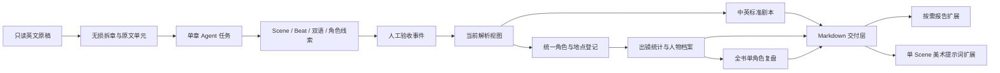

# bilingual-preprod-system

面向解说剧生产的双语前筹 Agent 系统。它从英文 TXT、Markdown 或 DOCX 原稿开始，完成无损拆章、中英标准剧本、Scene/Beat、角色统一、出镜统计、人物档案、人工复盘，以及按需报告和美术提示词任务。

核心流程支持断点续跑，每次只向 Agent 暴露一个有界任务。机器事实使用 JSON/JSONL，默认用户交付使用清洗后的 Markdown；只有用户指定某一个文件时才转换 DOCX。

## 当前能力

- 原文逐字保留，按 `P01`、`P02`……稳定拆章。
- 区分叙述、动作、对白、心理与其他文本，并保存中英对应。
- 按制片时空切分 Scene，按目标、冲突、信息或重大情绪变化切分 Beat。
- 使用具体场景名，无法确定的信息保留为待确认。
- 跨章统一角色、别名与旧 ID；确认同一人后，下游只看到统一角色。
- 生成全角色章节出镜矩阵、主要角色场景统计和角色基础信息档案。
- 允许对某一章、Scene、Beat、原文单元或文本片段进行追加式人工修订和撤销。
- 完整材料结束后，按角色逐个处理仍未确认的人物资料。
- 报告和美术提示词作为按需扩展运行，不拖慢核心章节管线。

## 系统架构



系统分为四层：

1. **事实源层**：`source/` 保存原文件、正文基线、章节切片和指纹，禁止覆盖。
2. **结构化事实层**：`data/` 保存分析、人工事件、解析视图、登记、档案、出镜和管线状态。
3. **工作层**：`work/` 每次只保存当前单章、定向修复或单角色复盘任务。
4. **交付与扩展层**：`deliverables/` 保存用户可读 Markdown；`extensions/` 保存按需模块状态和任务包。

完整数据契约见 [`references/data_contract.md`](references/data_contract.md)，总管线恢复与成本规则见 [`references/pipeline_rules.md`](references/pipeline_rules.md)。

## 运行要求

- Python 3.11 或更高版本。
- 核心脚本仅使用 Python 标准库，无需安装额外包。
- 从仓库根目录执行命令。
- 原稿和生成项目默认放在被 Git 忽略的 `project/` 下，避免把项目内容误提交到代码仓库。

以下命令中的 `<project>` 表示某次项目目录，例如 `project/full-book-run`。

## 快速启动

### 1. 接收全本原稿

```text
python scripts/run_pipeline.py start <source-file> --project-dir <project> --title <project-title>
```

示例：

```text
python scripts/run_pipeline.py start project/input/full-book.docx --project-dir project/full-book-run --title "Full Book Test"
```

启动后查看：

- `deliverables/制作进度.md`：普通用户进度页。
- `work/pipeline/next-task.json`：Agent 当前唯一任务。

### 2. 执行唯一下一任务

Agent 只读取 `work/pipeline/next-task.json` 声明的输入、规则和输出位置：

- `analyze_chapter`：完成当前 P 编号章节分析。
- `repair_chapter`：只修复校验器列出的错误。
- `review_character_profile`：只复盘当前角色的压缩线索包。

不要提前加载后续章节，也不要重新读取已经完成的整本原文。

### 3. 续跑

Agent 完成当前任务后执行：

```text
python scripts/run_pipeline.py resume <project>
```

管线会复用所有指纹和校验均有效的结果，并生成下一项唯一任务。重复执行，直到状态为 `complete`。

随时查看状态：

```text
python scripts/run_pipeline.py status <project>
python scripts/validate_pipeline.py <project>
```

## 人工验收入口

普通用户优先阅读：

- `work/review/pNN.review.md`：单章问题清单，包含英文线索和中文参考。
- `work/registry/entities.md`：角色归并候选。
- `work/recap/角色资料复盘清单.md`：全书人物资料待确认项。

不要直接编辑 JSONL。通过维护脚本追加事件，旧事实会保留并可撤销。

针对章节、Scene 或 Beat 增加说明：

```text
python scripts/review_analysis.py note <project> --chapter P03 --scope P03-S001 --note "用户补充说明"
```

修订允许修改的字段：

```text
python scripts/review_analysis.py set <project> --chapter P03 --scope P03-S001 --field time_of_day.value --value-json '"night"' --note "用户确认"
```

确认两个角色记录属于同一人：

```text
python scripts/manage_character_identities.py merge <project> --source CHAR-0008 --target CHAR-0002 --canonical-name Viktor --chinese-name 维克多 --note "用户确认两者为同一角色"
```

确认人物资料：

```text
python scripts/manage_profile_decisions.py set <project> --character Violette --field story_role --value 女主 --note "用户确认剧情定位"
```

完整材料仍无法确认某角色的其余参数时，验收当前单角色复盘包：

```text
python scripts/run_pipeline.py ack-recap <project> --character CHAR-0001 --note "完整材料仍未说明，其余参数保留待确认"
```

每个事件工具都提供对应的 `retract` 命令。具体边界见 [`references/review_workflow.md`](references/review_workflow.md)。

## 按需扩展

扩展不会随核心管线自动运行，也不能覆盖 `source/` 或核心 `data/`。

查看可用扩展：

```text
python scripts/run_extension.py list
```

生成不复制已有内容的前筹导航总览：

```text
python scripts/run_extension.py prepare <project> --module reports
```

为一个 Scene 准备美术提示词事实包：

```text
python scripts/run_extension.py prepare <project> --module art-prompts --target P03-S001
```

校验扩展输入版本、指纹和产物：

```text
python scripts/run_extension.py validate <project> --module reports
python scripts/run_extension.py validate <project> --module art-prompts
```

美术 Agent 每次只读取一个 Scene 的事实包，并按 [`references/art_prompt_extension_rules.md`](references/art_prompt_extension_rules.md) 输出一个 Markdown 文件。

## 维护入口

| 维护目标 | 入口 |
|---|---|
| 核心 Agent 工作流 | `SKILL.md` |
| 数据目录、稳定 ID、版本和扩展契约 | `references/data_contract.md` |
| 单章语义、Scene/Beat 和证据规则 | `references/analysis_rules.md` |
| 人工事件、撤销和解析视图 | `references/review_workflow.md` |
| 断点续跑与成本控制 | `references/pipeline_rules.md` |
| 机器格式 | `schemas/*.schema.json` |
| 总管线调度 | `scripts/run_pipeline.py` |
| 单章分析准备与校验 | `scripts/prepare_analysis.py`、`scripts/validate_analysis.py` |
| 跨章角色统一 | `scripts/build_registries.py`、`scripts/manage_character_identities.py` |
| 人物档案与决定 | `scripts/build_profiles.py`、`scripts/manage_profile_decisions.py` |
| 出镜与主要角色统计 | `scripts/build_appearance_reports.py` |
| 可插拔扩展 | `extensions/*/extension.json`、`scripts/run_extension.py` |
| 自动回归测试 | `tests/` |

### 修改后的最低验证

```text
python scripts/validate_schemas.py
python -m unittest discover -s tests -v
```

对真实项目修改后，再运行：

```text
python scripts/validate_pipeline.py <project>
python scripts/validate_extensions.py <project>
```

### 新增扩展

1. 在 `extensions/<module>/extension.json` 声明输入数据类型、兼容版本、运行模式和输出位置。
2. 实现 `handler.py:prepare`，核心输入只允许来自 `project.json`、`source/` 和 `data/`。
3. 私有过程文件写入 `extensions/<module>/`；用户交付写入清单声明的 Markdown 路径。
4. 保存输入类型、Schema 版本、SHA-256、模块版本、生成时间和输出哈希。
5. 添加测试，证明扩展不会修改核心事实、相同输入能够复用、输入变化能够被检测。

### Schema 兼容规则

- 新增可选字段：次版本升级。
- 删除、重命名字段或改变语义：主版本升级。
- 下游读取结构化事实，不重新解析 Markdown。
- 扩展遇到不兼容版本必须停止，不允许静默使用。

## 最终交付

核心项目默认包含：

- `deliverables/scripts_bilingual/pNN.md`
- `deliverables/全角色章节出镜表.md`
- `deliverables/主要角色场景统计.md`
- `deliverables/角色基础信息档案.md`
- `deliverables/制作进度.md`

报告扩展可增加 `deliverables/前筹总览.md`；美术扩展按 Scene 增加独立 Markdown。相同内容不重复输出多个格式，DOCX 只对用户明确指定的单个 Markdown 做确定性转换。
