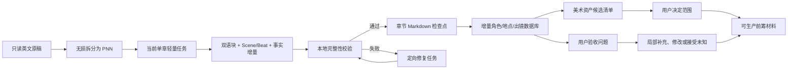

# bilingual-preprod-system

一套面向普通创作者的轻量解说剧前筹工具。输入完整英文剧本或小说，借助当前 Agent 逐章完成语义处理；本地程序负责校验、合并和生成用户可读材料。用户无需另行配置模型 API。

当前版本为 V3。V2 的重型流程已由 Git 标签 `v2-heavy-pipeline-final` 和远程分支 `iteration/v2` 保存。

## 最终能得到什么

- 每章一份中英标准剧本，明确区分叙述、动作、对白和内心。
- 具体到生产空间的 Scene，以及 Scene 内的 Beat。
- 全剧角色信息库、场景信息库和角色章节出镜表。
- 每位主要角色的独立场景统计。
- 全文需要用户审核的美术资产候选清单。
- 带英文线索和中文参考的待确认问题。
- 项目制作进度和可恢复检查点。

默认交付 Markdown。只有用户指定某一个文件时才转换 DOCX。

## 为什么 V3 更快

V2 的一次实测中，约 7 KB 的英文章节生成了约 79 KB 的分析 JSON，单章输入还同时加载了分析包、长规则和大 Schema。V3 做了四项根本调整：

1. 每个英文字符只保存在一个双语块中，证据只引用编号。
2. 每章默认只有一次语义任务，失败才定向修复。
3. 角色、地点、出镜、资产和 Markdown 全部由本地程序确定性合并。
4. 每章通过后立即保存检查点，网络或对话中断不会重跑已完成章节。

单章规则与上下文开销目标不超过 8 KB；单章结构结果不得超过“源文件 × 4 + 12 KB”。完整基线见 [V3 数据契约](references/data_contract.md)。

## 系统架构



模型只参与图中的“当前单章轻量任务”。其余步骤不调用模型。

## 运行要求

- Python 3.11 或更高版本。
- 核心流程仅使用 Python 标准库。
- 支持 `.txt`、`.md` 和 `.docx` 输入。
- 在仓库根目录运行命令。

## 快速开始

### 1. 接收全本原稿

```text
python scripts/run_pipeline.py start <source-file> --project-dir <project> --title <project-title>
```

例如：

```text
python scripts/run_pipeline.py start project/input/full-book.docx --project-dir project/full-book-run --title "Full Book Test"
```

启动后查看：

- `deliverables/制作进度.md`：面向用户的进度。
- `work/pipeline/next-task.json`：Agent 当前唯一任务。

### 2. 让 Agent 完成当前章

Agent 读取 `next-task.json` 指向的单章包，直接生成声明的章节 JSON。它不应该另写批量 API 脚本，也不需要用户提供第三方模型密钥。

### 3. 继续

```text
python scripts/run_pipeline.py resume <project>
```

系统会校验当前章、生成中英 Markdown、增量更新全剧数据库，然后准备下一章。重复直到状态为 `ready_for_review`。

随时查看或校验：

```text
python scripts/run_pipeline.py status <project>
python scripts/validate_pipeline.py <project>
```

## 人工验收

用户无需阅读 JSONL。请查看：

- `work/review/pNN.review.md`：某一章的问题，含英文线索和中文参考。
- `deliverables/待确认问题汇总.md`：全剧问题导航。
- `deliverables/全文美术资产候选清单.md`：决定哪些角色、场景、服装或道具需要设计。

用户可以直接说“修改 P03-S002 的时间”“补充 P08 某场”“ISS-P03-0001 接受未知”或“合并两个角色”。Agent 会用维护命令记录局部事件并重建受影响文件。具体命令见 [人工验收说明](references/review_workflow.md)。

## King 与 Viktor 这类跨章身份

章节记录不会被回写。后文或用户确认 King 就是 Viktor 后，系统把 King、国王、Viktor、维克多及旧编号都索引到同一个角色 ID。其他模块无论使用哪个名称，都会读取同一角色资料。该机制也适用于其他角色和地点，并支持撤销。

## 美术资产边界

系统只列出全文可能需要设计的资产、剧情明确变体和出现位置。用户可选择：确认、合并、拆分、不制作或资料待补充。

系统不会自动决定造型、色彩、灯光、镜头、构图或建筑风格。角色三视图、场景图和提示词只能在用户确认资产范围并补充设计要求后，作为后续扩展运行。

## 单文件转换为 DOCX

```text
python scripts/convert_to_docx.py <selected.md> --output <selected.docx>
```

只有被指定的文件会转换；默认项目不会同时生成整套 Markdown 和 DOCX 副本。

## 项目数据位置

```text
project/
├─ source/                 # 只读原稿、正文基线和章节切片
├─ data/chapters/          # 单章紧凑机器事实
├─ data/reviews/           # 只追加验收事件
├─ data/catalogs/          # 全剧角色、地点、出镜和资产数据库
├─ work/                   # 当前单章任务与用户验收页
└─ deliverables/           # 清洗后的 Markdown 成品
```

## 维护入口

| 维护目标 | 文件 |
|---|---|
| Agent 完整工作方式 | `SKILL.md` |
| 数据边界、性能线和交付模板 | `references/data_contract.md` |
| 单章翻译、Scene/Beat、角色与地点规则 | `references/analysis_rules.md` |
| 局部修改、撤销、实体归并和资产决定 | `references/review_workflow.md` |
| 断点恢复、成本与失败处理 | `references/pipeline_rules.md` |
| 单章机器格式 | `schemas/chapter.schema.json` |
| 总调度 | `scripts/run_pipeline.py` |
| 全剧数据库 | `scripts/build_catalogs.py` |
| 后续报告与美术扩展入口 | `extensions/README.md` |

## 开发验证

```text
python scripts/validate_schemas.py
python -m unittest discover -s tests -v
```

真实项目再运行：

```text
python scripts/validate_pipeline.py <project>
```

回归测试覆盖原文无损、输入/输出成本边界、跨章身份归并、增量缓存、局部修改与撤销、资产决策和单文件 DOCX 转换。
